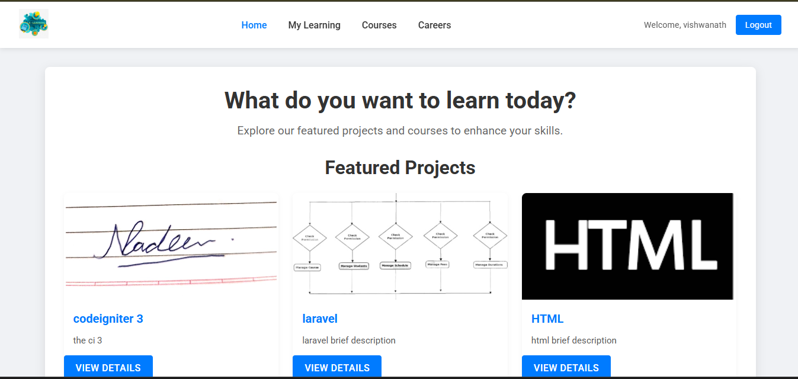

# 🎓 E-Learning System

An advanced **E-Learning Platform** designed to help students learn interactively, take exams, and receive personalized course recommendations. The system includes **student dashboards, course modules, exams, and machine learning-based recommendations** for personalized learning paths.

---

## 🚀 Features
- 🔐 User Authentication (Login/Register for Students & Admins)  
- 📚 Course Management (Add, Update, Enroll in Courses)  
- 📝 Online Exams with Auto-Grading  
- 🤖 Smart Course Recommendation System (Content + Collaborative Filtering)  
- 💬 Messaging System between Students & Instructors  
- 📊 Admin Dashboard with Analytics & Reports  

---

## 🛠️ Tech Stack
- **Frontend:** HTML, CSS, JavaScript (or React if used)  
- **Backend:** PHP (CodeIgniter 3) / Django / Node.js [choose your backend]  
- **Database:** MySQL  
- **Machine Learning:** Python (for course recommendation system)  
- **Tools & Libraries:** Bootstrap, Chart.js, Pandas, Scikit-learn  

---

## 📸 Screenshots
| Dashboard | Course View | Exam Module |
|-----------|-------------|-------------|
|  |  |  |

> *(Add your screenshots inside `docs/screenshots/` and update paths above)*  

---

## ⚡ Installation & Setup

### 🔧 Prerequisites
- PHP 7+ / Python 3.8+  
- MySQL Database  
- Composer / Pip  

### 📥 Clone the Repository
```bash
git clone https://github.com/your-username/e-learning-system.git
cd e-learning-system
